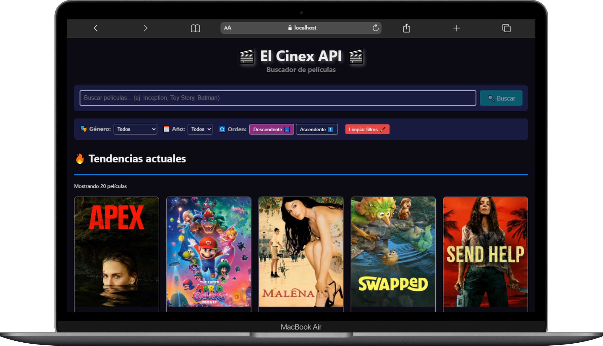
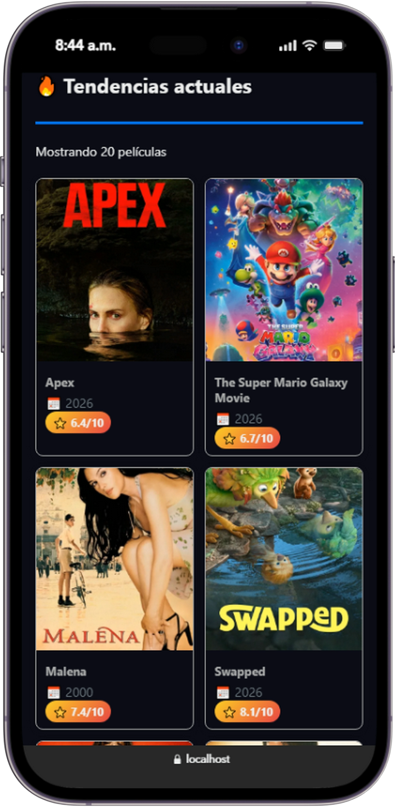
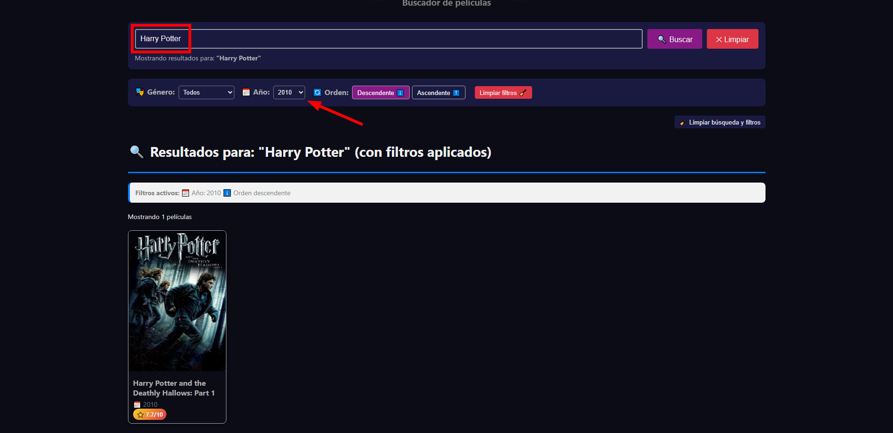
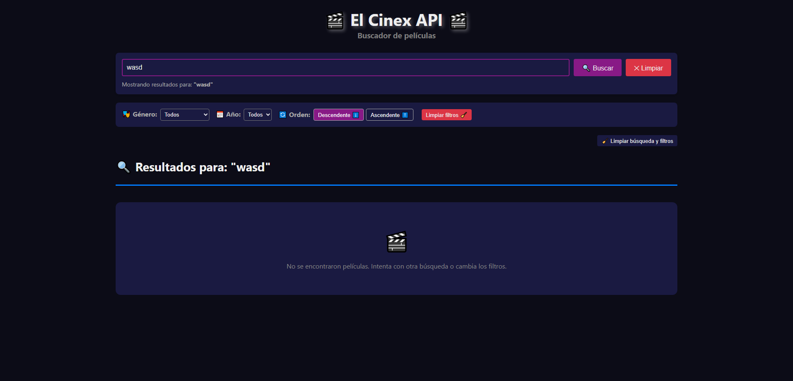

# El Cinex (buscador-películas-API(TMDb))

Aplicación web para buscar y descubrir películas utilizando la API de The Movie Database (TMDb) con buscador, filtros y diseño web responsive.

## Vista previa (capturas)
| Vista principal | Vista móvil |
|----------------|----------|
|  |  |

| Búsqueda con filtros | Búsqueda no encontrada |
|----------------|----------|
|  |  |

## Características y Funcionalidades principales
- Búsqueda de películas por título
- Filtros por género (Acción, Comedia, Drama, etc.)
- Filtros por año de lanzamiento (1900 - actualidad)
- Ordenado ascendente/descendente
- Búsqueda avanzada: búsqueda + filtros (funcionan juntos)
- Permite iniciar búsquedas con "Enter"
- Diseño responsive adaptado a móviles
- Manejo de estados con carga y errores

## Tecnologías utilizadas
- React
- CSS3
- JavaScript
- TMDb API

## Notas
- Para arrancar el proyecto se necesita configurar la API key para ello se debe crear un archivo `.env` en la raíz del proyecto y colocarle la Key de la siguiente manera `REACT_APP_TMDB_API_KEY="api_key"`

## Descripción de **flujo de trabajo**
El proyecto se dividió en varias faces
- Preparación de herramientas
- conexión con la API de TMDb
- Construcción de la interfaz de usuario
- Construcción de la lógica de filtrado

## Como funciona cada archivo
Componente principal `App.js` se encarga de mostrar las películas con sus filtros activos.
`tmdbService.js` maneja toda la lógica de la comunicación con la API (TMDb)
`searchBar` `MovieList` y `Filters` manejan la estructura de la aplicación y sus funciones de búsqueda, filtrado y como se muestran los resultados

## Aprendizajes
- Reforze mis conocimientos para integrar React con una API externa implementando consultas y manejo de la información obtenida
- Aprendí un mejor uso de "Manejo de errores" utilizando "try/catch" para errores de red y de API
- Aprendí a implementar de mejor manera la lógica de filtrado y búsqueda como filtros combinados y limpieza de datos

## Errores y características faltantes
- No muestra correctamente el orden ascendente cuando se realiza una búsqueda con nombre y filtros
- Falta agregar ventanas con información detallada al hacer click en una película
- Falta agregar lista de favoritos
- Toda la parte de CSS falta pulirla
  - Se utilizaron EmoJis en lugar de iconos para facilitar los estilos en CSS
  - Falta agregar mejores estilos CSS
  - Falta agregar mejores animaciones
